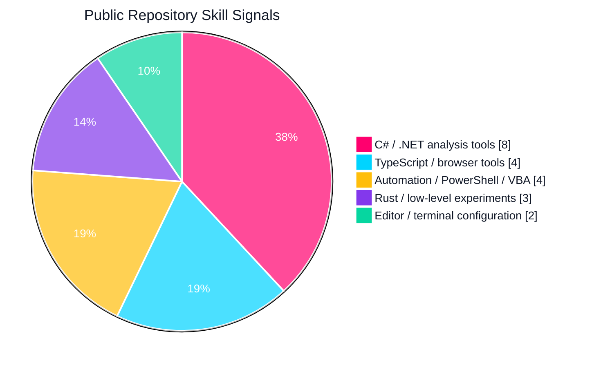
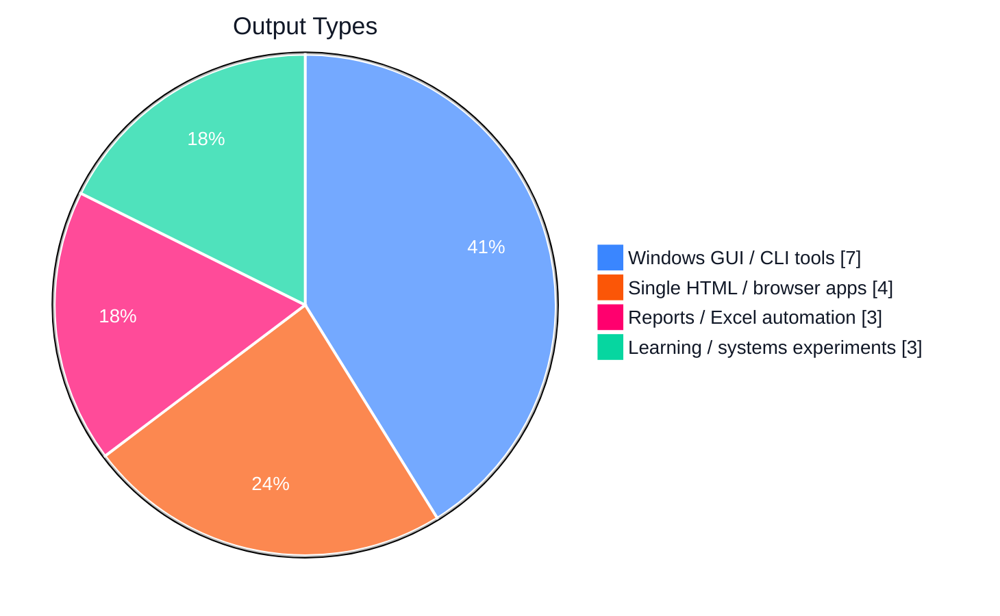
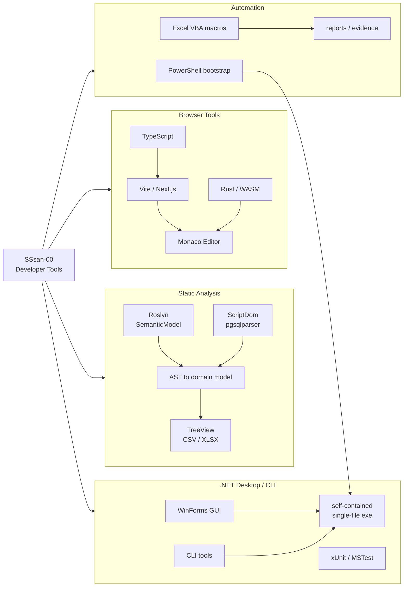
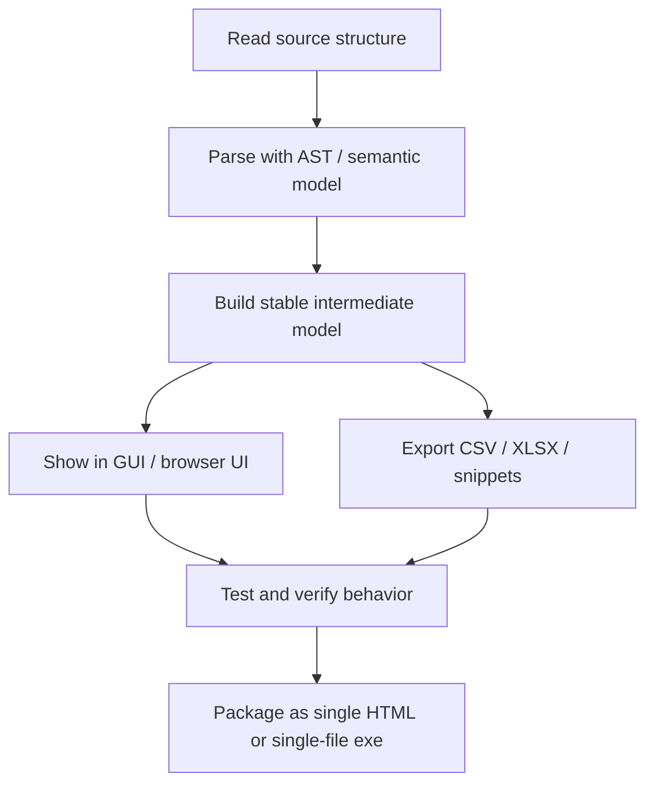

# SSsan-00

C# / .NET and TypeScript を中心に、静的解析ツール、Windows GUI/CLI、単一HTMLで動く開発支援ツールを作っています。

<!-- Generated from public repository metadata, README files, and manifests on 2026-06-07. -->

## Skill Snapshot

  
  
  
  
  
  

  
  
  
  
  
  
  

## Visual Charts

Repository-derived signals, not proficiency scores.

## Skill Map

## Repository Evidence

| Repository | Main Skills | Output |
| --- | --- | --- |
| [sql-analyzer](https://github.com/SSsan-00/sql-analyzer) | C#, .NET 9, WinForms, ScriptDom, pgsqlparser, xUnit | Postgres / T-SQL をTreeViewで追えるSQL解析ツール |
| [table-analyzer](https://github.com/SSsan-00/table-analyzer) | C#, Roslyn, SemanticModel, ScriptDom, CSV, XLSX | C# / Razor Pages からSQL利用テーブル候補を抽出 |
| [diff-viewer](https://github.com/SSsan-00/diff-viewer) | TypeScript, Vite, Monaco Editor, Rust/WASM, Vitest | 単一HTMLで動く差分ビューア |
| [TestCodeSnippetGenerator](https://github.com/SSsan-00/TestCodeSnippetGenerator) | C#, Roslyn, MSBuildWorkspace, MSTest, WinForms | MSTest用テストメソッドスニペット生成 |
| [ClassDiagramMaker](https://github.com/SSsan-00/ClassDiagramMaker) | C#, Roslyn, AST analysis, xUnit | C# ASTからクラス図作成を支援 |
| [BuilderBuilder](https://github.com/SSsan-00/BuilderBuilder) | HTML, JavaScript, MSTest, localStorage | DynamicData / Builderパターン用コード生成 |
| [TextLintByVBA](https://github.com/SSsan-00/TextLintByVBA) | VBA, Excel automation, integration tests | Excelセル文章チェックマクロ |

## Work Style

## Tech Stack

| Category | Skills |
| --- | --- |
| Languages | C#, TypeScript, PowerShell, VBA, Rust, SQL, JavaScript, Lua |
| .NET | .NET 9, WinForms, CLI tools, xUnit, MSTest, self-contained publish |
| Code analysis | Roslyn, SemanticModel, MSBuildWorkspace, Microsoft.SqlServer.TransactSql.ScriptDom, pgsqlparser |
| Frontend | Vite, Next.js, React, Tailwind CSS, Monaco Editor, Vitest |
| Data / reports | CSV, XLSX, Excel automation, static analysis reports |
| Tooling | pnpm, PowerShell, Shell scripts, GitHub, Neovim, WezTerm |

## Current Interests

- Static analysis tools that turn source code into practical reports
- Small Windows utilities that can be distributed as single-file executables
- Browser-based developer tools that run locally without a server
- TDD practice and code-generation workflows
- Rust experiments for CLI, WASM, and low-level learning
