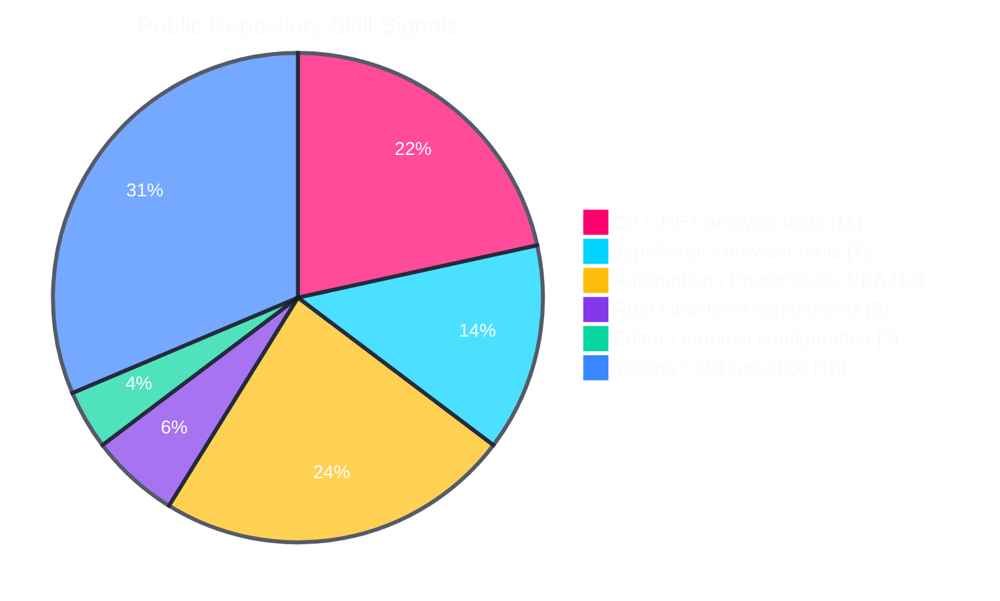
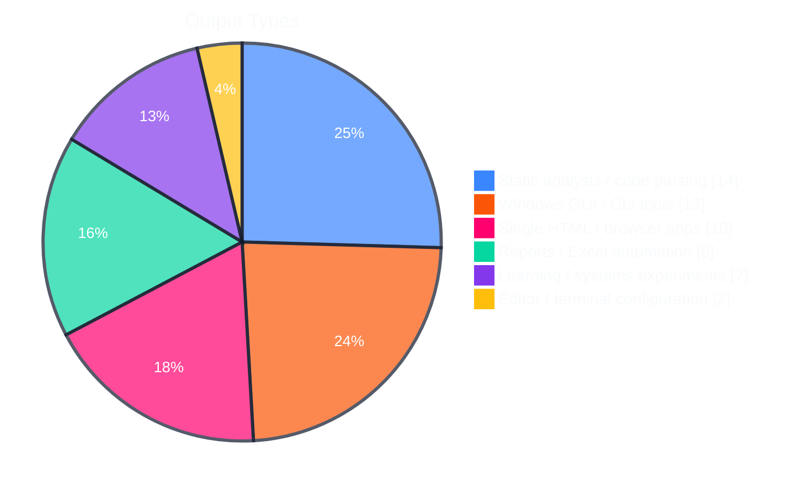
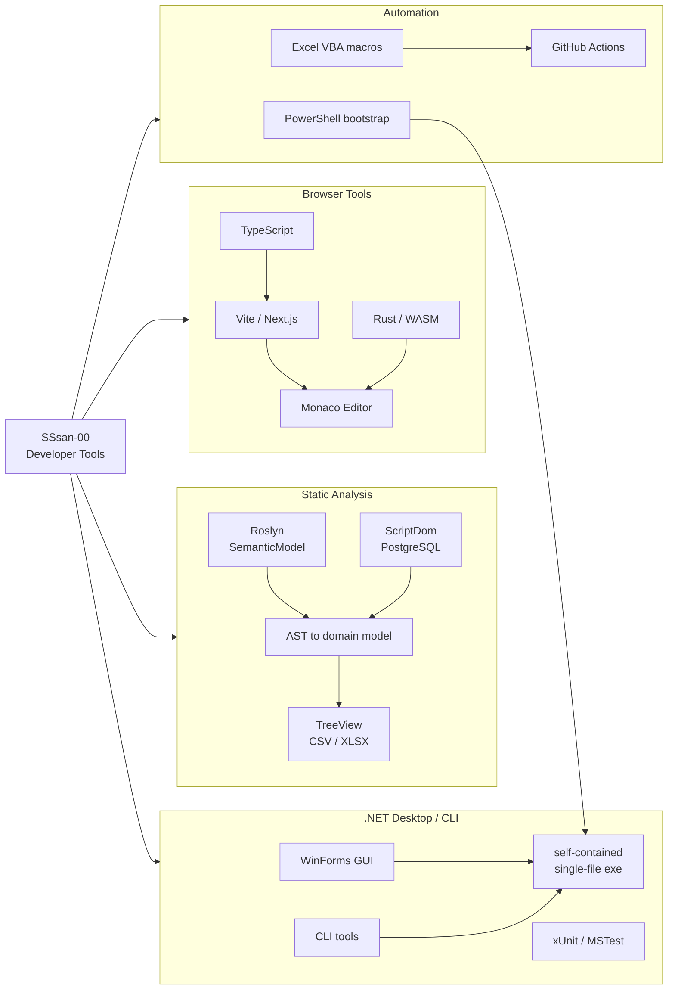
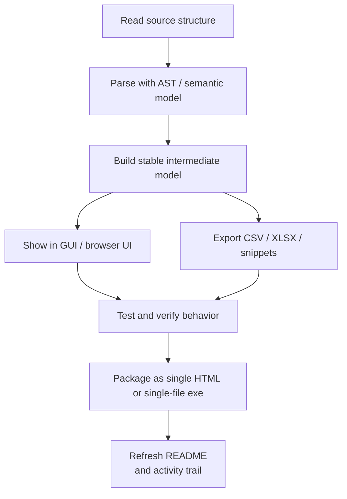

# SSsan-00

C# / .NET、TypeScript、Rust を中心に、静的解析ツール、Windows GUI/CLI、ブラウザで動く開発支援ツール、Excel自動化を作っています。

<!-- Generated from public repository metadata, README files, manifests, and repository languages on 2026-08-13. -->
<!-- To change this README, update scripts/update-readme.mjs. Manual edits are overwritten by the scheduled workflow. -->

## Skill Snapshot

  
  
  
  
  
  

  
  
  
  
  
  
  
  

## Contribution Trail

Daily GitHub activity rendered as a neon contribution path.

<picture>
  <source media="(prefers-color-scheme: dark)" srcset="assets/github-snake-dark.svg">
  <source media="(prefers-color-scheme: light)" srcset="assets/github-snake.svg">
  
</picture>

## Visual Charts

Repository-derived signals, not proficiency scores.

## Skill Map

## Featured Projects

<table>
  <tbody>
  <tr>
    <td width="50%" valign="top"><a href="https://github.com/SSsan-00/table-analyzer"><strong>table-analyzer</strong></a> Table Analyzer は、C# / Razor Pages のソースコードを読み取り専用で解析し、SQLで利用しているテーブル候補をCSVまたはXLSXに出力するツールです。CLI と Windows GUI を用意しています。  <strong>Skills</strong>        <strong>Project Type</strong>   </td>
    <td width="50%" valign="top"><a href="https://github.com/SSsan-00/sql-analyzer"><strong>sql-analyzer</strong></a> T-SQL analyzer WinForms tool  <strong>Skills</strong>        <strong>Project Type</strong>  </td>
  </tr>
  <tr>
    <td width="50%" valign="top"><a href="https://github.com/SSsan-00/diff-viewer"><strong>diff-viewer</strong></a> 差分を視覚化する  <strong>Skills</strong>        <strong>Project Type</strong> </td>
    <td width="50%" valign="top"><a href="https://github.com/SSsan-00/TestCodeSnippetGenerator"><strong>TestCodeSnippetGenerator</strong></a> MSTest を .NET 9.0 環境で開発しているユーザー向けに、既存テストクラスへ貼り付けるためのテストメソッドスニペットを生成する WinForms アプリです。  <strong>Skills</strong>        <strong>Project Type</strong>  </td>
  </tr>
  <tr>
    <td width="50%" valign="top"><a href="https://github.com/SSsan-00/ClassDiagramMaker"><strong>ClassDiagramMaker</strong></a> C# AST-based class diagram generator  <strong>Skills</strong>        <strong>Project Type</strong>   </td>
    <td width="50%" valign="top"><a href="https://github.com/SSsan-00/functions-analyzer"><strong>functions-analyzer</strong></a> WinFormsで操作するC#ソース解析ツールです。選択した .cs ファイル内の通常のメソッド定義をRoslyn ASTで解析し、メソッド名、XMLドキュメントコメントの &lt;summary&gt;、仮引数名、戻り値の型をExcelブックに出力します。  <strong>Skills</strong>        <strong>Project Type</strong>   </td>
  </tr>
  </tbody>
</table>

## Repository Evidence

| Repository | Main Skills | Output |
| --- | --- | --- |
| [sql-analysis-formatter-vba](https://github.com/SSsan-00/sql-analysis-formatter-vba) | C#, .NET 9, .NET, PowerShell, VBA, ScriptDom, MSTest | Excel VBA macro to convert SQL identifiers to Japanese display names using a worksheet mapping. |
| [ClassDiagramMaker](https://github.com/SSsan-00/ClassDiagramMaker) | C#, .NET 9, .NET, PowerShell, Roslyn, SemanticModel, WinForms | C# AST-based class diagram generator |
| [table-analyzer](https://github.com/SSsan-00/table-analyzer) | C#, .NET 9, .NET, PowerShell, Roslyn, SemanticModel, WinForms | Table Analyzer は、C# / Razor Pages のソースコードを読み取り専用で解析し、SQLで利用しているテーブル候補をCSVまたはXLSXに出力するツールです。CLI と Windows GUI を用意しています。 |
| [CoverageReportGenerator](https://github.com/SSsan-00/CoverageReportGenerator) | C#, .NET, PowerShell, HTML, Roslyn, WinForms, MSTest | C# / WinForms で作成した、JetBrains dotCover DetailedXML から HTML / Excel カバレッジレポートを生成するツールです。 |
| [sql-analyzer](https://github.com/SSsan-00/sql-analyzer) | C#, .NET 9, .NET, PowerShell, Roslyn, WinForms, ScriptDom | T-SQL analyzer WinForms tool |
| [angya-app](https://github.com/SSsan-00/angya-app) | TypeScript, JavaScript, PostgreSQL, Next.js, React, Tailwind CSS, Vitest | 行脚した場所や日時を登録する(TypeScript×Next.js) |
| [functions-analyzer](https://github.com/SSsan-00/functions-analyzer) | C#, .NET 9, .NET, PowerShell, Roslyn, WinForms, MSTest | WinFormsで操作するC#ソース解析ツールです。選択した .cs ファイル内の通常のメソッド定義をRoslyn ASTで解析し、メソッド名、XMLドキュメントコメントの &lt;summary&gt;、仮引数名... |
| [TextLintByVBA](https://github.com/SSsan-00/TextLintByVBA) | VBA, JavaScript, Excel | textlintをVBAで再現する試み |
| [ReportGeneratorDemo](https://github.com/SSsan-00/ReportGeneratorDemo) | C#, .NET, PowerShell, JavaScript, HTML, MSTest | .NET 8 + MSTest のテストコードを実行し、coverlet でカバレッジを収集して、ReportGenerator で HTML レポートを作るサンプルです。 |
| [Razor-Indent-Formatter](https://github.com/SSsan-00/Razor-Indent-Formatter) | TypeScript, HTML, Vite | Razor(.cshtml)ファイルのインデントを整形するツール |

## Work Style

## Tech Stack

| Category | Skills |
| --- | --- |
| Languages | C#, TypeScript, PowerShell, VBA, Rust, SQL, JavaScript, HTML, Lua, Python, Java |
| .NET | .NET 9, .NET, WinForms, CLI, xUnit, MSTest |
| Code analysis | Roslyn, SemanticModel, MSBuildWorkspace, ScriptDom, PostgreSQL, SQL |
| Frontend | TypeScript, Vite, Next.js, React, Tailwind CSS, Monaco Editor, Vitest, WASM |
| Data / reports | CSV, XLSX, Excel, VBA |
| Tooling | PowerShell, GitHub Actions, Neovim, WezTerm, Lua |

## Current Interests

- Static analysis tools that turn source code into practical reports
- Small Windows utilities that can be distributed as single-file executables
- Browser-based developer tools that run locally without a server
- TDD practice and code-generation workflows
- Rust experiments for CLI, WASM, and low-level learning
- Editor and terminal configuration
